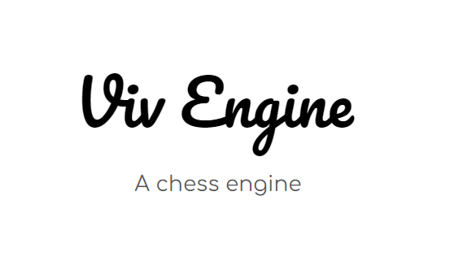

# viva-engine

made in 6 hours

current features: 

alphabeta pruning,
quiescence search,
iterative depth,

thats it, no idea what elo it is - lot better than me tho :[

for innovateX hack

# instructions to run

1. clone repo
2. install node if not yet
3. run `node engine.js`
